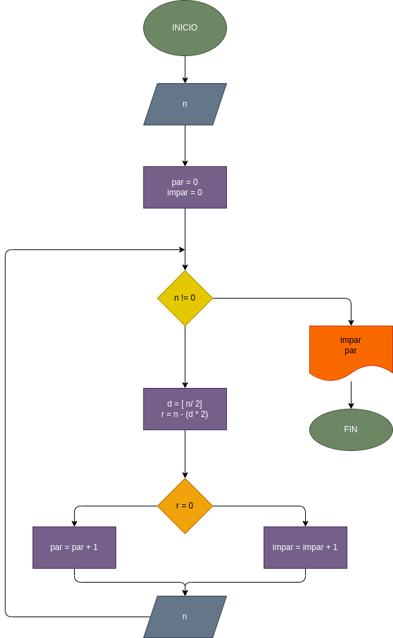

# Hacer el diagrama y el programa en seudocódigo, que lea numeros enteros y positivos(uno en cada lectura), y que averigue e imprima cuantos son pares y cuantos son impares. Para terminar utilizaremos el registro centinela,cuando el calor del numero leido sea cero

## Diagrama de flujo

